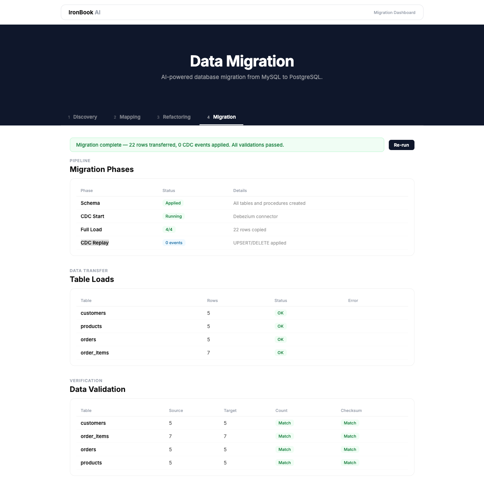

# Mini IronBook — AI-Powered Data Migration Service

Automates migrating MySQL databases to PostgreSQL using AI-assisted schema discovery, type mapping, stored procedure conversion, and CDC-based data transfer.



## Quick Start

```bash
cp .env.example .env
# Add your ANTHROPIC_API_KEY to .env

docker compose up -d
# Dashboard: http://localhost:8000
# DB Admin:  http://localhost:8080
```

## Pipeline

| Step | Name | What it does |
|---|---|---|
| 1 | **Discovery** | Scans MySQL — tables, columns, types, FKs, stored procedures, dependency graph |
| 2 | **Mapping** | Maps MySQL types to PostgreSQL (SQLGlot) + converts stored procedures (Claude AI) |
| 3 | **Refactoring** | Generates CREATE TABLE DDL, refactors procedures to modern SQL, validates against target |
| 4 | **Migration** | Applies schema, starts CDC, bulk COPY data, replays CDC events, validates checksums |

## Tech Stack

| Layer | Tech |
|---|---|
| Frontend | Vue 3 |
| Backend | FastAPI |
| AI | Claude Haiku 4.5 |
| SQL Parsing | SQLGlot |
| CDC | Debezium + Redpanda |
| Infra | Docker Compose |

## API

| Method | Endpoint | Description |
|---|---|---|
| POST | `/api/discovery/run` | Scan source database |
| POST | `/api/mapping/run` | Run type + procedure mapping |
| POST | `/api/refactoring/run` | Generate DDL + validate |
| POST | `/api/migration/run` | Execute full migration |
| GET | `/api/migration/status` | Migration state |

## Services

| Service | Port | Purpose |
|---|---|---|
| Backend | 8000 | FastAPI + Vue dashboard |
| Adminer | 8080 | Database admin UI |
| MySQL | 3306 | Source database |
| PostgreSQL | 5432 | Target database |
| Redpanda | 9092 | Kafka-compatible streaming |
| Debezium | 8083 | CDC connector |

## Adminer DB Connections

| | MySQL (source) | PostgreSQL (target) |
|---|---|---|
| System | MySQL | PostgreSQL |
| Server | `mysql` | `postgres` |
| Username | `migration` | `migration` |
| Password | `migration123` | `migration123` |
| Database | `source_db` | `target_db` |
